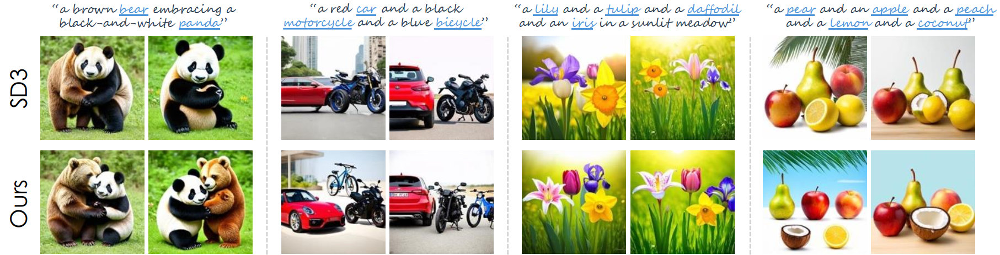

# Enhancing MMDiT-Based Text-to-Image Models for Similar Subject Generation

> This repository hosts the official PyTorch implementation of the paper: "**Enhancing MMDiT-Based Text-to-Image Models for Similar Subject Generation**".

Our approach can effectively mitigate the subject neglect or mixing issues suffered by MMDiT-based text-to-image models for similar subject generation.

Tianyi Wei1,
Dongdong Chen2,
Yifan Zhou1,
Xingang Pan1  
1S-Lab, Nanyang Technological University, 2Microsoft GenAI
